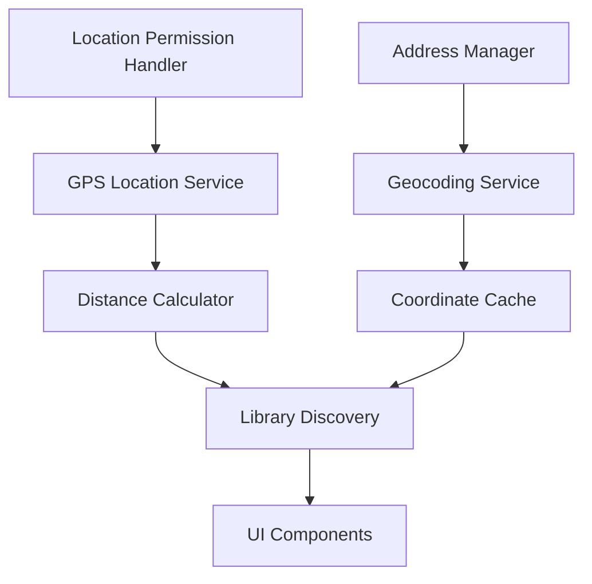

# Location-Based Features Design

## Overview

This design implements location-based features for the library management application using the simplest possible approach that maintains the existing architecture patterns. The implementation focuses on minimal complexity, fast development, and error-free operation by reusing established code patterns and using only free APIs.

The core functionality includes:
- Library address management with geocoding
- Distance-based library discovery and sorting
- Maps integration for navigation
- Cross-library book search with location awareness
- Comprehensive error handling and fallbacks

## Architecture

### High-Level Architecture

The location features follow the existing Flutter architecture pattern:

```
UI Layer (Screens/Widgets)
    ↓
Provider Layer (State Management)
    ↓
Service Layer (Business Logic)
    ↓
Repository Layer (Data Access)
    ↓
Firestore Database
```

### Location Services Integration



### Key Design Principles

1. **Reuse Existing Patterns**: Follow the established provider/repository/service pattern
2. **Minimal Dependencies**: Use only free Flutter packages (geolocator, geocoding, url_launcher, permission_handler)
3. **Graceful Degradation**: All features work without location permissions
4. **Caching Strategy**: Cache coordinates and distances to minimize API calls
5. **Error-First Design**: Handle all failure scenarios with clear user feedback

## Components and Interfaces

### 1. Data Model Extensions

#### LibraryModel Extension
Extend the existing `LibraryModel` to include location fields:

```dart
class LibraryModel {
  // ... existing fields ...
  final double? latitude;
  final double? longitude;
  final String? formattedAddress;
  
  // Add distance field for UI display (not stored)
  double? distanceFromUser; // Calculated at runtime
}
```

#### BookSearchResult Model
New model for cross-library search results:

```dart
class BookSearchResult {
  final BookModel book;
  final LibraryModel library;
  final double? distanceKm;
}
```

### 2. Service Layer

#### LocationService
Core service for all location operations:

```dart
class LocationService {
  // GPS and permission handling
  Future<Position?> getCurrentLocation();
  Future<bool> requestLocationPermission();
  
  // Distance calculations
  double calculateDistance(double lat1, double lon1, double lat2, double lon2);
  String formatDistance(double distanceKm);
  
  // Caching
  void cacheUserLocation(Position position);
  Position? getCachedLocation();
}
```

#### GeocodingService
Address to coordinates conversion:

```dart
class GeocodingService {
  Future<LocationResult> geocodeAddress(String address);
  void cacheCoordinates(String address, double lat, double lon);
  LocationResult? getCachedCoordinates(String address);
}
```

#### MapsService
Maps integration:

```dart
class MapsService {
  Future<void> openMaps(double latitude, double longitude, String label);
  bool canLaunchMaps();
}
```

### 3. Provider Layer

#### LocationProvider
Manages location state and coordinates with other providers:

```dart
class LocationProvider extends BaseProvider {
  Position? _userLocation;
  bool _hasLocationPermission = false;
  bool _isLoadingLocation = false;
  
  Future<void> requestLocation();
  void updateLibraryDistances(List<LibraryModel> libraries);
}
```

#### Enhanced LibraryProvider
Extend existing provider with location features:

```dart
class LibraryProvider extends BaseProvider {
  // Add location-aware methods
  List<LibraryModel> getLibrariesSortedByDistance();
  Future<void> updateLibraryAddress(String libraryId, String address);
}
```

#### CrossLibrarySearchProvider
New provider for cross-library book search:

```dart
class CrossLibrarySearchProvider extends BaseProvider {
  List<BookSearchResult> _searchResults = [];
  
  Future<void> searchBooksAcrossLibraries(String query);
  List<BookSearchResult> get searchResults;
}
```

### 4. UI Components

#### Address Input Widget
Professional address input with autocomplete:

```dart
class AddressInputWidget extends StatefulWidget {
  final Function(String address, double lat, double lon) onAddressSaved;
  final String? initialAddress;
}
```

#### Distance Display Widget
Reusable widget for showing distances:

```dart
class DistanceDisplay extends StatelessWidget {
  final double? distanceKm;
  final TextStyle? style;
}
```

#### Library Card with Location
Enhanced library card showing distance:

```dart
class LibraryCardWithLocation extends StatelessWidget {
  final LibraryModel library;
  final VoidCallback? onTap;
  final VoidCallback? onMapsTap;
}
```

## Data Models

### Extended LibraryModel

```dart
class LibraryModel {
  // Existing fields...
  final String id;
  final String name;
  final String adminUid;
  final String adminName;
  final String? description;
  final String? coverImageUrl;
  final String? address;
  final int memberCount;
  final int bookCount;
  final bool isFree;
  final double membershipFee;
  final List<MembershipPlan> plans;
  final String? razorpayKeyId;
  final DateTime createdAt;
  
  // New location fields
  final double? latitude;
  final double? longitude;
  final String? formattedAddress;
  
  // Runtime calculated field (not stored in Firestore)
  double? distanceFromUser;
}
```

### LocationResult Model

```dart
class LocationResult {
  final bool success;
  final double? latitude;
  final double? longitude;
  final String? formattedAddress;
  final String? error;
  
  const LocationResult({
    required this.success,
    this.latitude,
    this.longitude,
    this.formattedAddress,
    this.error,
  });
}
```

### BookSearchResult Model

```dart
class BookSearchResult {
  final BookModel book;
  final LibraryModel library;
  final double? distanceKm;
  final int availableCopies;
  
  const BookSearchResult({
    required this.book,
    required this.library,
    this.distanceKm,
    required this.availableCopies,
  });
}
```

### Firestore Schema Changes

#### Libraries Collection Update
```json
{
  "libraries/{libraryId}": {
    // ... existing fields ...
    "latitude": 12.9716,
    "longitude": 77.5946,
    "formattedAddress": "123 Main St, Bangalore, Karnataka 560001, India"
  }
}
```

#### Coordinate Cache Collection (New)
```json
{
  "coordinate_cache/{addressHash}": {
    "address": "123 Main St, Bangalore, Karnataka",
    "latitude": 12.9716,
    "longitude": 77.5946,
    "cachedAt": "2024-01-15T10:30:00Z"
  }
}
```

## Correctness Properties

*A property is a characteristic or behavior that should hold true across all valid executions of a system-essentially, a formal statement about what the system should do. Properties serve as the bridge between human-readable specifications and machine-verifiable correctness guarantees.*

After analyzing the acceptance criteria, I've identified properties that can be combined to eliminate redundancy and provide comprehensive validation:

### Property 1: Address Geocoding Round Trip

*For any* valid address with street, city, and country components, geocoding the address and then reverse geocoding the coordinates should produce an equivalent address.

**Validates: Requirements 1.2, 1.3, 11.1, 11.5**

### Property 2: Distance Calculation Accuracy

*For any* two valid coordinate pairs, the calculated distance using Haversine formula should match the expected mathematical result within acceptable precision.

**Validates: Requirements 3.4, 12.4**

### Property 3: Library Distance Sorting

*For any* user location and list of libraries with coordinates, sorting libraries by distance should result in a list where each library is closer than or equal to the next library in the list.

**Validates: Requirements 3.1, 3.3, 6.3**

### Property 4: Distance Format Display

*For any* distance value, the formatted display should show meters for distances under 1000m and kilometers for distances over 1000m, with appropriate units and precision.

**Validates: Requirements 3.2, 3.6, 3.7, 6.2**

### Property 5: Caching Behavior

*For any* cacheable operation (location, geocoding, distance calculation), performing the same operation twice should use cached results on the second call without making external API requests.

**Validates: Requirements 2.2, 8.1, 8.2, 8.3**

### Property 6: Fallback Functionality

*For any* location-dependent feature, when location services are unavailable or permission is denied, the system should provide alternative functionality (alphabetical sorting, manual input, etc.) without errors.

**Validates: Requirements 3.5, 4.3, 6.7, 9.1, 9.6**

### Property 7: Cross-Library Search Completeness

*For any* book search query, the results should include books from all libraries where the query matches title, author, or ISBN, with each result containing library information and availability status.

**Validates: Requirements 6.1, 6.5, 6.6, 7.2**

### Property 8: Address Validation Completeness

*For any* address input, validation should reject addresses missing required components (street, city, country) and accept addresses containing all required components.

**Validates: Requirements 1.3, 11.1, 11.2**

### Property 9: Maps Integration URL Generation

*For any* library with valid coordinates, generating a maps URL should include the latitude, longitude, library name, and address in the correct format for the target platform.

**Validates: Requirements 5.2, 5.3, 5.5, 12.3**

### Property 10: Permission State Handling

*For any* permission state (granted, denied, permanently denied), the system should provide appropriate user feedback and maintain functionality through fallback mechanisms.

**Validates: Requirements 4.4, 9.4, 9.5**

### Property 11: Data Persistence Round Trip

*For any* library with location data, saving the library to Firestore and then retrieving it should preserve all location fields (latitude, longitude, formatted address) with proper precision.

**Validates: Requirements 1.4, 7.3, 7.4, 7.6**

### Property 12: Error Handling Graceful Degradation

*For any* external service failure (geocoding, maps, GPS), the system should display appropriate error messages and continue functioning with cached data or alternative methods.

**Validates: Requirements 1.7, 2.5, 5.4, 5.6, 9.2, 9.3**

## Error Handling

### Error Categories and Responses

#### 1. Location Permission Errors
- **Denied**: Show explanation of impact, provide alphabetical sorting fallback
- **Permanently Denied**: Guide user to device settings with clear instructions
- **Not Determined**: Request permission with clear explanation of benefits

#### 2. GPS and Location Errors
- **GPS Unavailable**: Use cached location if available, otherwise fallback to no-location mode
- **Location Timeout**: Show loading state, then fallback after reasonable timeout (10 seconds)
- **Accuracy Too Low**: Accept location but warn user about potential inaccuracy

#### 3. Geocoding Service Errors
- **API Quota Exceeded**: Use cached coordinates, show warning to admin
- **Invalid Address**: Highlight specific validation errors, suggest corrections
- **Network Failure**: Use cached data, show offline indicator
- **Multiple Matches**: Present selection dialog with address options

#### 4. Maps Integration Errors
- **No Maps App**: Show error with alternative options (copy coordinates, web maps)
- **Launch Failure**: Provide fallback options (address copy, directions text)
- **Invalid Coordinates**: Validate before attempting to launch maps

#### 5. Cross-Library Search Errors
- **Network Failure**: Show cached results with offline indicator
- **Large Dataset Timeout**: Implement pagination, show partial results
- **No Results**: Suggest alternative search terms, show popular books

### Error Recovery Strategies

#### Automatic Recovery
- Retry failed operations with exponential backoff
- Use cached data when external services fail
- Gracefully degrade to basic functionality

#### User-Initiated Recovery
- Pull-to-refresh for updating location and library data
- Manual coordinate entry when geocoding fails
- Settings screen for managing location preferences

#### Logging and Monitoring
- Log all errors with context for debugging
- Track API usage to prevent quota exceeded errors
- Monitor performance metrics for optimization

## Testing Strategy

### Dual Testing Approach

The location-based features require both unit testing and property-based testing for comprehensive coverage:

**Unit Tests** focus on:
- Specific examples of address validation and formatting
- Error handling scenarios with mocked failures
- UI component behavior with different states
- Integration points between services
- Platform-specific behavior verification

**Property-Based Tests** focus on:
- Universal properties that hold for all inputs (distance calculations, sorting, caching)
- Comprehensive input coverage through randomization
- Edge cases discovered through generated test data
- Round-trip properties for data persistence and API calls

### Property-Based Testing Configuration

**Library Selection**: Use `test` package with custom property generators
**Test Configuration**: Minimum 100 iterations per property test
**Tagging Format**: Each test tagged with `Feature: location-based-features, Property {number}: {property_text}`

### Test Implementation Requirements

#### Property Test Examples

```dart
// Property 1: Distance Calculation Accuracy
testWidgets('Feature: location-based-features, Property 1: Distance calculation accuracy', (tester) async {
  // Generate random coordinate pairs
  // Calculate distance using Haversine formula
  // Verify result matches expected mathematical calculation
});

// Property 3: Library Distance Sorting
testWidgets('Feature: location-based-features, Property 3: Library distance sorting', (tester) async {
  // Generate random user location and library list
  // Sort libraries by distance
  // Verify each library is closer than or equal to the next
});
```

#### Unit Test Examples

```dart
// Specific address validation example
test('should reject address missing city component', () async {
  final address = "123 Main St, Karnataka 560001, India"; // Missing city
  final result = await addressManager.validateAddress(address);
  expect(result.isValid, false);
  expect(result.missingComponents, contains('city'));
});

// Error handling example
test('should show appropriate error when geocoding fails', () async {
  // Mock geocoding service to fail
  // Attempt to save address
  // Verify error message is displayed
});
```

### Testing Coverage Requirements

- **Unit Tests**: 90% code coverage for service and provider layers
- **Property Tests**: All 12 correctness properties implemented
- **Integration Tests**: End-to-end flows for major user journeys
- **Platform Tests**: Android and iOS specific behavior verification

### Mock and Test Data Strategy

#### Service Mocking
- Mock external APIs (Google Geocoding, GPS) for consistent testing
- Use test doubles for Firestore operations
- Implement fake location providers for testing

#### Test Data Generation
- Generate realistic coordinate pairs within valid ranges
- Create diverse address formats for validation testing
- Use property generators for comprehensive input coverage

#### Performance Testing
- Test with large library datasets (1000+ libraries)
- Verify caching effectiveness under load
- Measure response times for location operations

This testing strategy ensures both correctness and performance while maintaining the simplicity and reliability required for fast, error-free implementation.